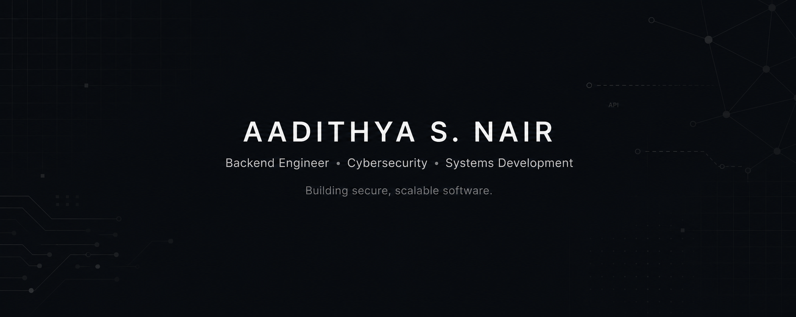
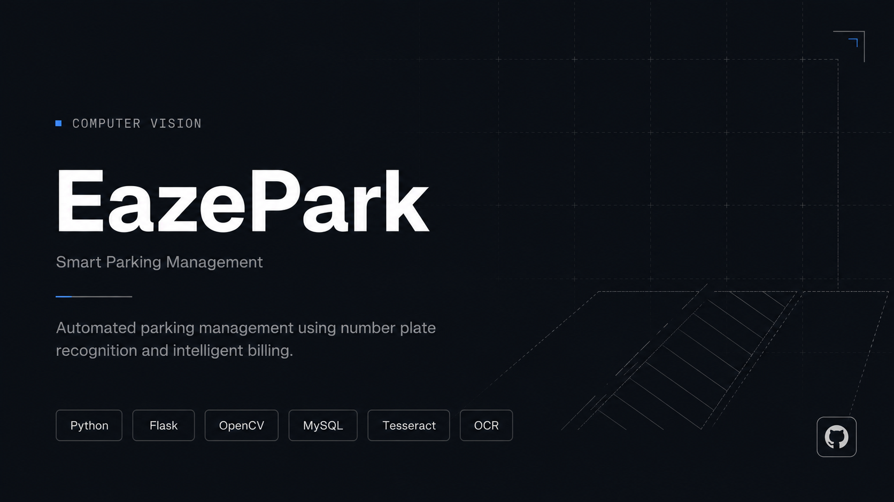
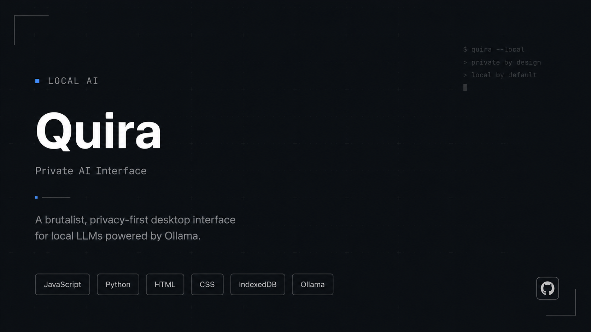
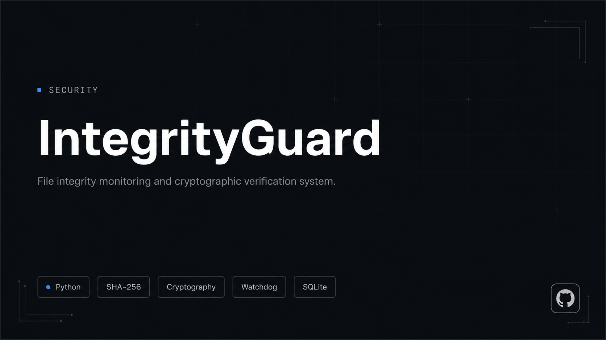
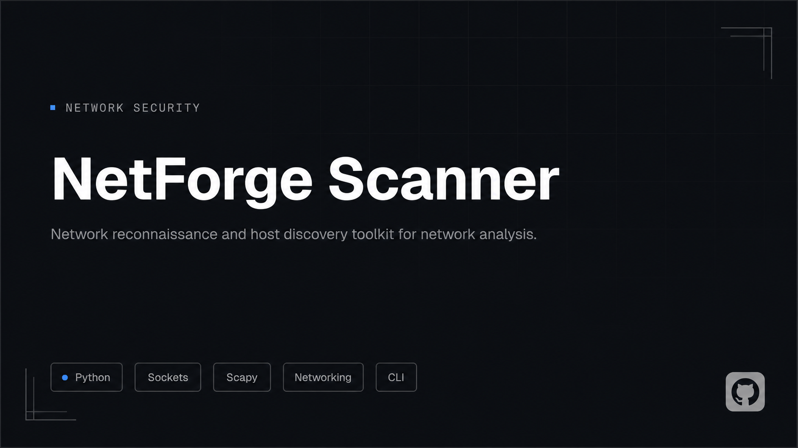

<b>Student Computer Science (Cybersecurity)<b>

---

## About

I'm a Computer Science (Cybersecurity) student interested in backend engineering, AI security, and systems programming.

My work focuses on building secure APIs, developer tools, and network utilities. I enjoy designing software that is simple, reliable, and built to scale.

---

## Current Focus

- Backend Architecture
- Network Security
- Open Source Software

---

## Selected Projects

<table>
<tr>

<td width="50%" align="center">

### EazePark

Smart parking management platform focused on automation, accessibility, and efficient parking solutions.

</td>

<td width="50%" align="center">

### Quira

Private local AI interface powered by Ollama, designed for secure offline conversations.

</td>

</tr>

<tr>

<td width="50%" align="center">

### Integrity Guard

File integrity monitoring system for detecting unauthorized changes and maintaining system security.

</td>

<td width="50%" align="center">

### NetForge Scanner

Network discovery and security scanning toolkit for reconnaissance and analysis.

</td>

</tr>

</table>

---

## Technology

### Languages

  

### Backend

  

### Frontend

  

### Databases

  

### AI & Machine Learning

  
  

### Infrastructure

  

### Security

  
  
  
  
  

---

## GitHub

---

## Engineering Principles

- Build software that solves real problems.
- Design with security from the beginning.
- Keep systems simple and maintainable.
- Optimize for reliability before complexity.
- Write code that others can understand.

---

<table>
<tr>

<td align="center" width="50%">

<i>"Simplicity is prerequisite for reliability."</i> 
<b>— Edsger W. Dijkstra</b>

</td>

<td align="center" width="50%">

<i>"Performance is my business."</i> 
<b>— Carroll Shelby</b>

</td>

</tr>
</table>

